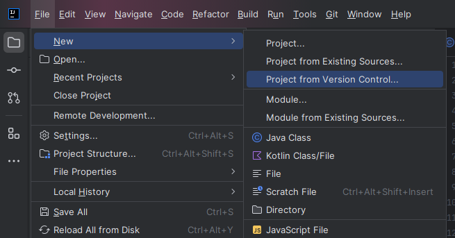
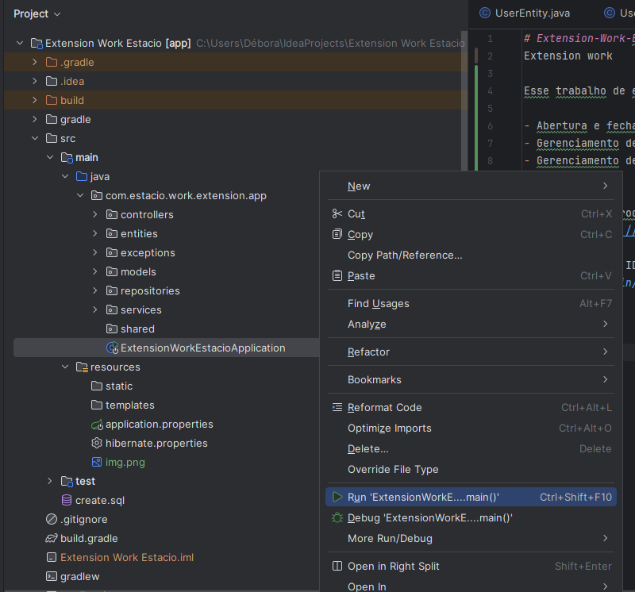

# Extension-Work-Estacio
Extension work

Esse trabalho de extensão tem como objetivo resolver um problema de uma empresa oferecendo um serviço de chamados, aonde poderão ser realizados as seguintes funções:

- Abertura e fechamento de chamados
- Gerenciamento de usuários
- Gerenciamento de departamentos

## Ambiente
Para conseguir rodar o projeto iremos precisar de uma IDE, recomendo usar o IntelliJ.

Download: https://www.jetbrains.com/idea/download/

Após instalar a IDE em seu devido sistema operacional (Windows, Mac ou Linux), clone o projeto conforme a imagem:

Depois desse processo, o IntelliJ irá baixar as dependencias do projeto automaticamente. Em seguida,rode o projeto conforme a imagem:

## Workflow
Após rodar o projeto, ele ficará disponível na porta :8080. Certifique-se de que não aja nenhum outro processo rodando nesta porta.
É possível de acessar os endpoints disponíveis através da URL: http://localhost:8080/swagger-ui/index.html

